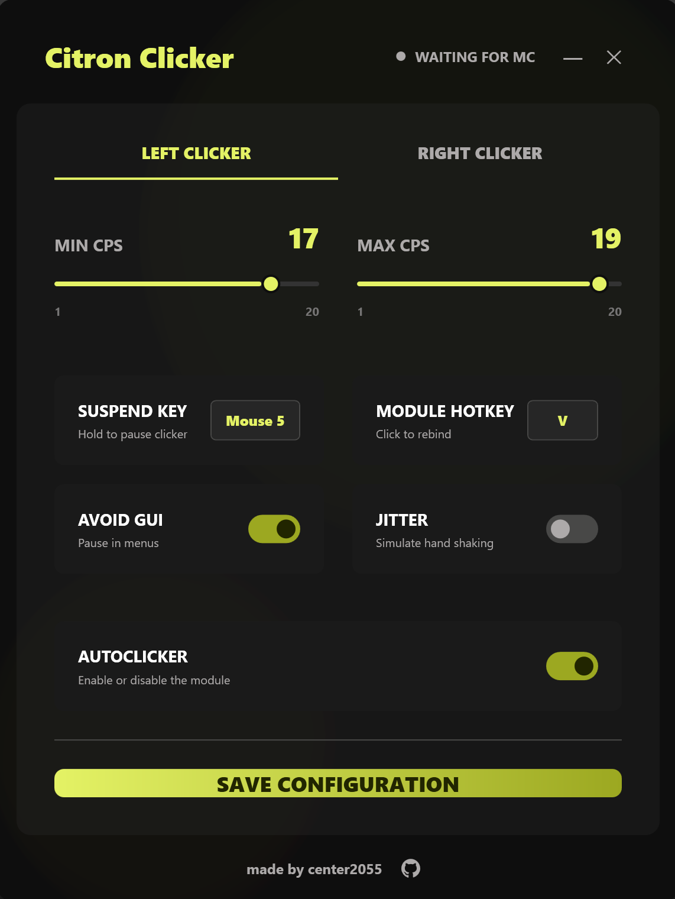

# Citron Clicker

Citron Clicker is a high-performance, cleanly designed autoclicker specifically built and optimized for Minecraft Bedrock and Java Edition. It features a modern user interface and precise clicking mechanics to ensure accurate CPS rates.

## Features

* Left and Right Clicker: Configure independent settings for both left and right mouse buttons.
* Precise CPS: Accurate clicks per second ranging from 1 to 20.
* Suspend Key: Bind a key (keyboard or mouse) to temporarily pause the clicker, allowing normal interactions like block breaking.
* Module Hotkey: Quickly toggle the autoclicker on or off using a custom bind.
* Avoid GUI: Automatically pauses clicking when a menu or inventory is open (detects cursor visibility).
* Jitter: Simulates natural hand movement with configurable intensity.
* Configuration Saving: Automatically saves and loads your custom profiles.
* Clean Injection: Operates externally with low-level mouse hooks for accurate input simulation.

## Screenshot

## Links

* [Discord](https://discord.gg/y3MVspPzKQ)
* [Ko-fi](https://ko-fi.com/center2055)